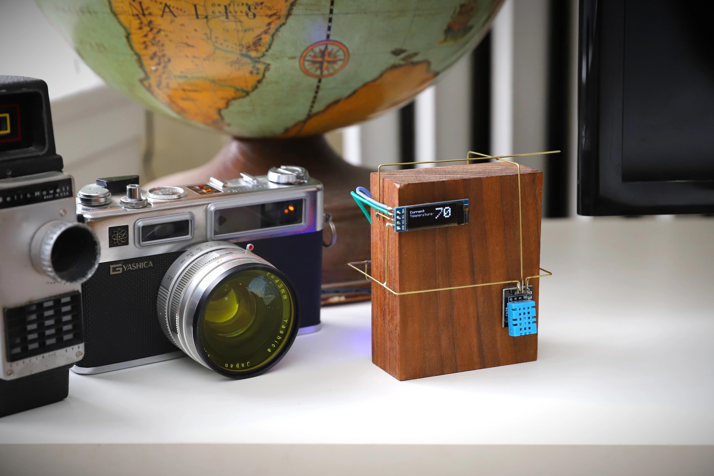
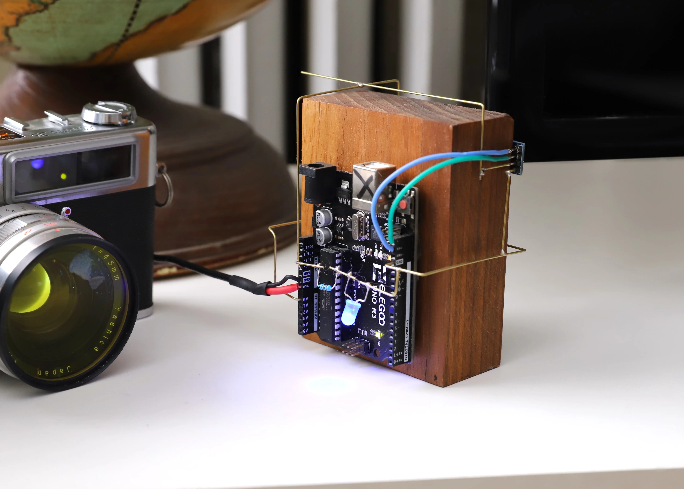
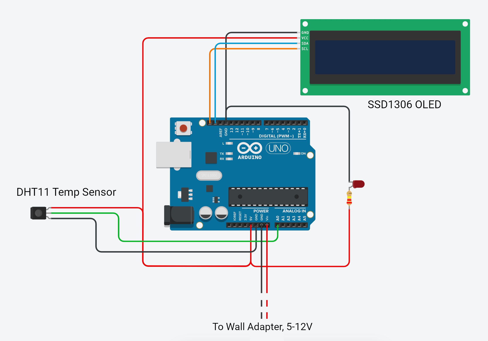
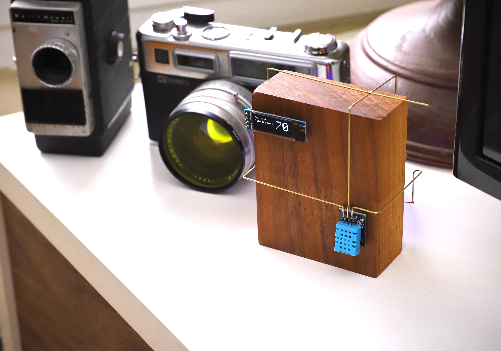

# Room Temperature Circuit Sculpture
A circuit sculpture to tell you the temperature of the room while also looking nice on a shelf.

This sculpture is built using an Arduino, brass rods, and walnut.




## Materials

| Part      | Quantity | Notes| 
| :-------------- | :---: | :------ |
| Arduino Uno | 1 | You can use any arduino you want but for the size of this build, an Uno works well visually|
| 1mm brass rod | ~3 ft | K&S Precision Metals |
| silicone wire    |  | Gives the sculpture a bit of variety, instead of being all brass rod |
| 220 ohm resistor  | 1 | Higher resistance value if you want the light to be dimmer| 
| LED  | 1 | In your preferred color, for ambient backlight| 
| DHT11| 1 | Temperature sensor. Get the 3-pin version |
| SSD1306 OLED   | 1 | 128x32 |
| Wall Adapter  | 1 | Needs to be between 5-12V|
| Nano Tape  |  | Any brand will do|


## Code
The code for this sculpture is written in C++. It is provided in a .ino file, which can be opened in the arduino IDE. Just download the relevant libraries and it should work right out of the box.

If you would like to use a different IDE (like PlatformIO in VSCode for instance) you will just need to add:
```
#include <Arduino.h>
```
at the top of the file.

## Assembly
The build uses 1mm brass rod as most of its wiring. K&S Precision Metals is the best source for these. It's important to use 1mm exactly, because that is what fits into the GPIO pins of the Arduino boards.

Brass rods have a few things going for them that make them good for this:
1. Hold solder very well
2. Pliable, while still being able to retain shape
3. Look nice



> **Note**
> I chose to use regular silicone-insulated wire for the two I2C wires on the OLED, while everything else is brass rods. This was for purely asthetic reasons - I wanted some variety. You don't need to do the same.

Attaching the components to the wood is done with "nano tape". Nano tape is - from what I can tell - a real product that functions differently from regular tape. But it doesn't matter. If you search Amazon for nano tape, there are a million knock-offs that are basically just heavy-duty double-sided tape, and that's what we need. It works extremely well for this type of application.

Attach the components first. Use the tape to experiment with where you want to place everything. Once you have the layout all figured out, use the brass rods to connect up the wiring.

### Wiring Diagram


>**Note**
>The temperature sensor and OLED display pictured in the diagram don't look like exactly like the actual components, don't let that throw you.

Since we are powering this device via the VIN pin, you need to provide a bit more than 5 volts. I used a 9V wall adapter, which works great. Just snip off whatever connector is on the end, and strip 4-5mm of insulation off the end of each wire. Tin it with a little bit of solder, and you should easily be able to insert them into the arduino pins. Just make sure you use a multimeter to verify which wire is Positive and which is Ground!


## Wood Finishing

Brass rod pairs nicely with walnut, and I had a bunch left over from a larger project. I used Rubio Monocoat ("pure" color) as a finish. I highly recommend it as a finish in general, but it's definitely overkill for this project if you don't already have it on hand. 

If your looking for something else, I would recommend basically any kind of oil-based finish. This piece is really not going to get any kind of wear & tear, and oil finishes look better than finishes that are designed more for protection. Shellac would also work nicely.

**REMEMBER:** You need to finish the wood BEFORE attching the electronics!



